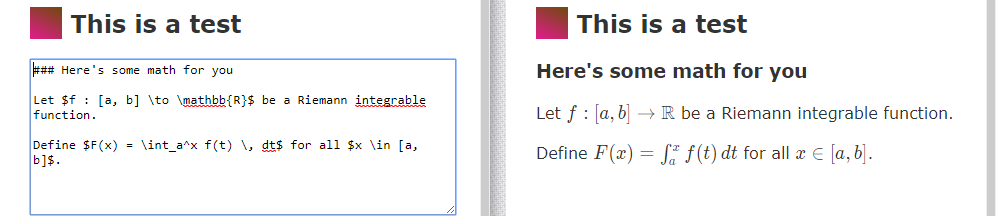
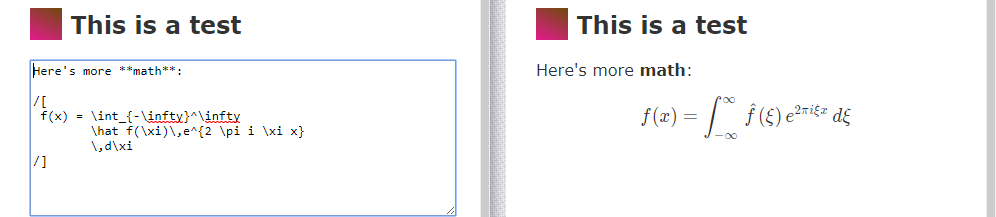
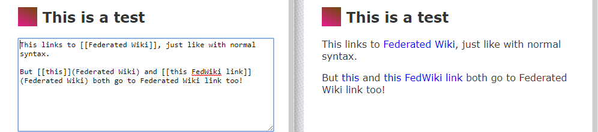

# Federated Wiki - Marked with KaTeX and FedWiki support Plug-in

**MarkedEx** is a Federated Wiki plug-in to create paragraphs with Markdown.

This plug-in was initially intented to simply provide [KaTeX](https://github.com/Khan/KaTeX) support to make math rendering faster,
but eventually extended typesetting support with Markdown was deemed also necessary.

## How it works

This plug-in uses [Marked](https://github.com/chjj/marked) to render Markdown with the following modifications:

### KaTeX support
 
Surround your LaTeX inline math with dollar signs (`$`) to render the math in text:

For larger, centered math blocks use `/[ /]`:

### Federated Wiki links

Because Marked comes with its own sanitizer, link support was added to Marked manually.
Use `[[ ]]` to add internal links, just as in Federal Wiki itself.

**NOTE:** Because link creation is done through Marked, it cannot currently build proper "pathing" that Federal Wiki requires
to access pages from other wikis. This could be fixed in the future.

### Alias link

Unlike in Federated Wiki, you can link to the same page using different link names (aliases). 
Do that with `[[ <alias name> ]]( <original name> )`. This will create a link that will display
`<alias name>` but will link *internally* to `<original name>`:

**NOTE:** Do not create pages with this setup. Currently Federated Wiki uses the value in `<a>` tag to
set the title of the new page (even though it has pageName data in the tag.) If you use the alias link to
create a new page, it will use *the alias* as the title for a new page instead of the intended original name.
However, if the page exists, it will work just fine.
